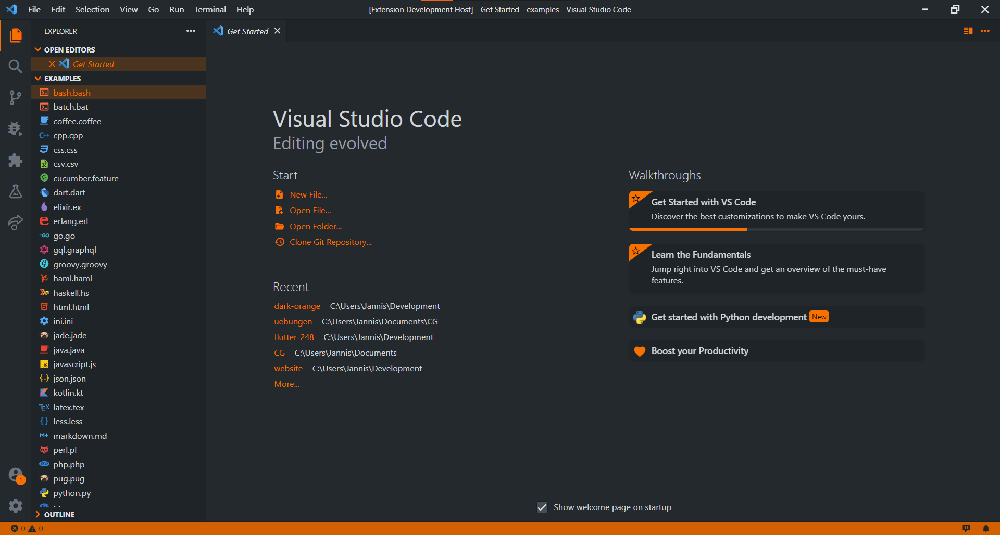
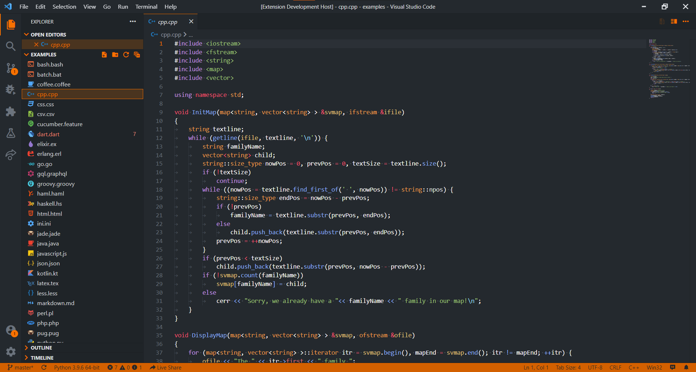

  

# Dark Orange

Dark theme with orange accent based on the [Github dark theme](https://github.com/primer/github-vscode-theme).

## Screenshots

### Welcome Page

### Python Code

### C++ Code

## Acknowledgements

- This theme is based on [Github dark theme](https://github.com/primer/github-vscode-theme)
- This theme is inspired by beautiful elements of [Nanowise Galaxy](https://github.com/istevkovski/nanowise-dark-vscode)
- Activity bar icons made by [Material Product Icons](https://marketplace.visualstudio.com/items?itemName=PKief.material-product-icons) extension
- Folder and file icons by [Material Icon Theme](https://marketplace.visualstudio.com/items?itemName=PKief.material-icon-theme)
- Dark Orange icon components made by [Freepik](https://www.freepik.com) from [www.flaticon.com](https://www.flaticon.com/)
- Syntax highlighting examples cloned from https://github.com/uloco/syntax-highlighting-samples
